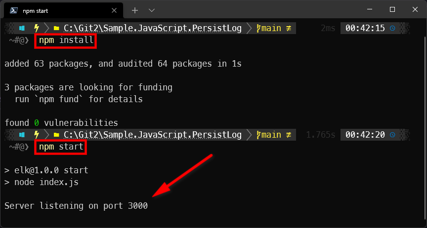
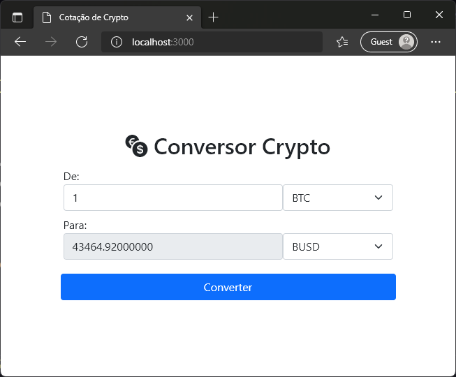

# NodeJS e ElasticSearch: Persistindo mensagens do console.log no banco de dados

Não existe dev de JavaScript nesse mundo que não conheça o `console.log()`! Todo mundo usa. Mas uma coisa legal seria gravar as mensagens de log em um banco de dados para consulta posterior. Seja para investigar bugs ou ajudar na tomada de decisão em relação a novas funcionalidades da aplicação. Mas neste caso estou falando de logs do lado do servidor. O `console.log()` do navegador (Chrome, Edge, Firefox, etc.) continua lá como sempre esteve, mas no backend com NodeJS podemos seguir com essa abordagem.

**O código-fonte que temos aqui é didático.** Uma pequena aplicação com frontend estático (apenas um `index.html`) que se comunica com uma api servida pelo *express* do NodeJS. É um conversor de criptomoedas que usa a API aberta da *Binance* em [api2.binance.com/api/v3/ticker/24hr](https://api2.binance.com/api/v3/ticker/24hr/).

Sendo uma aplicação tipo NPM, para executar use a sequência de comandos a seguir:

```
npm install
npm start
```



*Figura 1: Output da instalação e execução via NPM.*

Em seguida abra a aplicação na url [http://localhost:3000/](http://localhost:3000/) em seu navegador de internet.



*Figura 2: Tela do aplicativo web.*

## Expert

| [](https://github.com/sergiocabral) |
| :-: |
|[sergiocabral.com](https://sergiocabral.com)|
